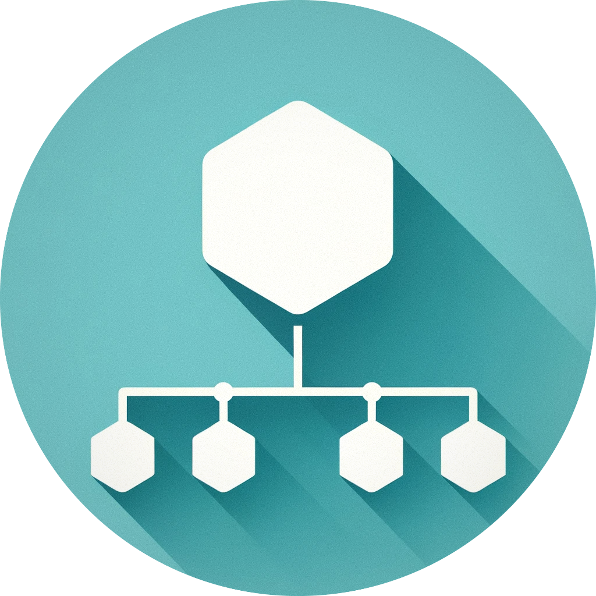

# VertiGIS Workflow Vanguard Tools  

  

  

Welcome, fellow no-code and GIS  enthusiasts! The **VertiGIS Workflow Vanguard Tools** project serves as a free extension for the lovely “VertiGIS Studio Workflow” system.  We’ve crafted custom activities that go beyond the standard offerings, seamlessly integrates into your existing workflow environment.

### What’s in?

Data Sorcery: Ever wished you could manipulate data like a wizard? Within this project, we introduce several custom activities that enhance workflow to handle with data:

1. [**Get Data**](docs/GetData.md): This activity retrieves data from nested arrays, objects, or collections using "dot" notation. It allows you to access specific keys within deep data structures: `foo.bar.0.baz`.

2. **Set Data**: The "Set Data" activity enables you to update values within nested data. Whether it's altering an array element an object property.

3. **Has Data**: Use the "Has Data" activity to check for the existence of specific keys or values within your data. It's particularly useful for conditional logic and decision-making within workflows.

4. **Filter Data**: The "Filter Data" activity lets you narrow down your dataset based on specific criteria. Whether you're dealing with arrays or objects, this activity ensures data filtering with only one node.

All these activities support **wildcards** using asterisks. You can target any key within an collection: `foo.*.id`

---

***Answering the Silent Call by Filling the Void in GIS No-Code Technology***
